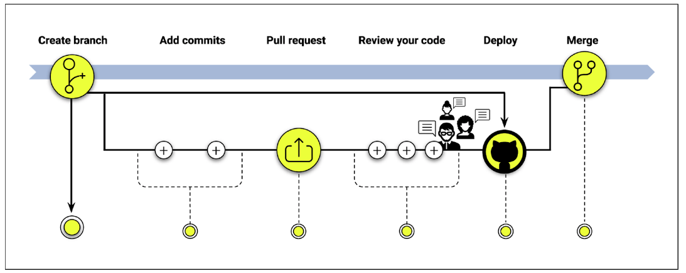

# KeplerExoplanets

## Presentation

### Selected topic
Exoplanet — searching for a new World beyond our solar system

### Reason why the topic has been selected
Is Earth the only habitable planet in the universe? Scientists and researchers are searching for planets that can provide similar living conditions for human, and those planets are called “exoplanet”. We want to investigate the exoplanet data provided by NASA Exoplanet Archive and find a habitable planet. 

### Description of the source of data
* https://exoplanetarchive.ipac.caltech.edu/index.html
* https://www.kaggle.com/nasa/kepler-exoplanet-search-results

### Questions we hope to answer with the data
* How many confirmed planets?
* What type of planets consider as confirmed planets? 
* Which confirmed planet is closest to Earth?
* What are the characteristics of confirmed planets? 
* Based on the characteristics, which confirmed planet is the most habitable? 
* What are the most recent discovered confirmed planets? 
* How often are exoplanets confirmed in the existing liteatures disconfirmed by measurement from Kepler?

Google slides drafting:
https://docs.google.com/presentation/d/1aQ9Man76uhiFXY43nu5pnqOB6zrk1MvBqSxHWUtZ_Y0/edit?usp=sharing

## GitHub
### Communication protocols
After each pull request (PR), the person in charge of the github repository will review the code and ask for team assistance if necessary.

After the PR has been accepted, the person who made the PR will merge her/his code to the main branch and alert the team that their own personal branch or sub-branch needs to be updated with the latest version of the main branch.

## Machine Learning Model
Our target result is binary: Is it a planet or not. The dataset is labeled (koi_pdisposition).

#### Based on the Dataset we will be evaluating the below (4) models.
|Model name|Benefits|Limits|
|---|--|--|
|Supervised ML logistic Regression|Easy to understand predictions| Could struggle with high dimensional datasets and correlated features|
|Gradient Boosted Tree|High-performing Easy to understand predictions|Sensitive to outliers|
|Random Forest|High-performing Robust against overfitting Fast to train|Not easy to understand predictions|
|Neural Net (Sigmoid activation)|Handle extremely complex tasks|Slow to train Almost impossible to understand predictions|

#### EDA & Preprocessing
Null Values
- A large number of Null values (40k+)are present in the raw data. After preprocessing (including dropping unneeded columns) 3,572 remain
- We are evaluating several methods for handling these: Dropping, Imputing (Mean, Median, Mode)

Feature Evaluation & Selection
- We are currently leveraging a Correlation Matrix and Feature Importance Graph to guide feature selection

Creating test & train datasets
- Initially we set the targey(y) to koi_pdisposition and the features to the remaining columns based on the feature evaluation process
- The training & testing set are split in default manner which works out to 75% train & 25% test

Scaling
- The processed dataframe is scaled using ScikitLearns's standard scaler before the models are ran

## Database
We are using the Postgres DB, currently an instance residing on Damien's local machine.

Created a DB called "kepler", with one initial table called "raw_kepler".
- The table is a one-to-one map wth the source CSV data file.

Project DB files of note:
- The DB & table definition SQL files are in the project Database folder.
- The source CSV file is in the project Resources folder.
- The source file was copied from this kaggle source - https://www.kaggle.com/nasa/kepler-exoplanet-search-results?select=cumulative.csv

Use the PG Admin Import/Export tool to import the CSV file.
An initial load resulted in the following outcome:
- "Successfully run. Total query runtime: 215 msec. 9564 rows affected."

*NOTE:*
During initial loading I assumed, based on an initial quick read of the page describing the data columns of our source data file, that the column "kepid" might be suitable as a unique primary key. That turned out to NOT be the case, further review of the data model is required.
- Data dictionary "Data Columns in Kepler Objects of Interest Table" is located here "https://exoplanetarchive.ipac.caltech.edu/docs/API_kepcandidate_columns.html#tce_info"

## Dashboard
